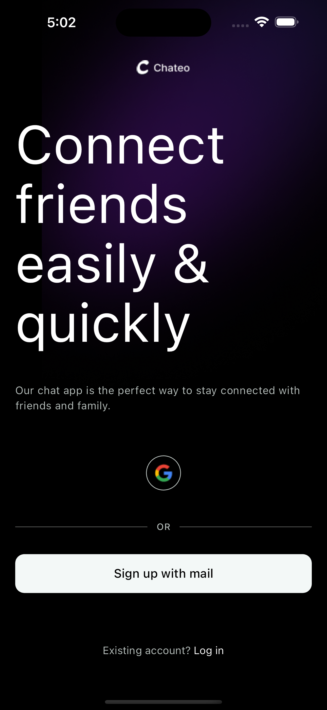
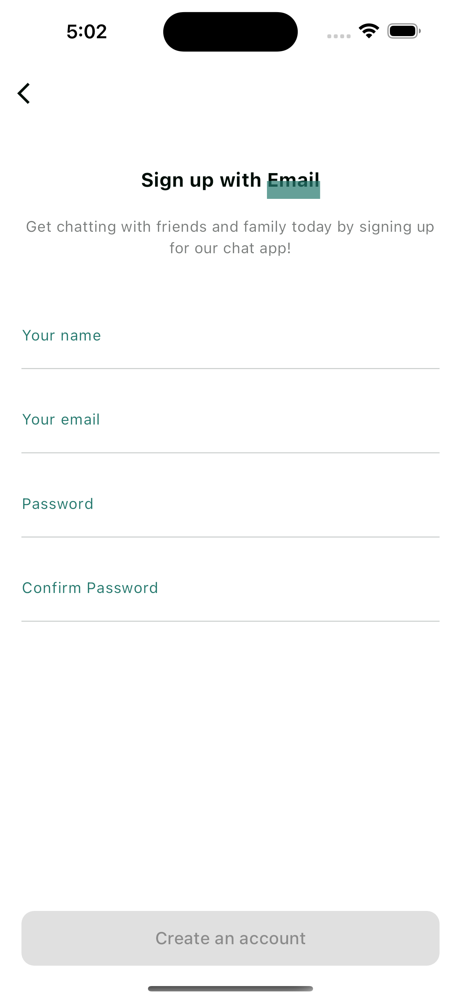
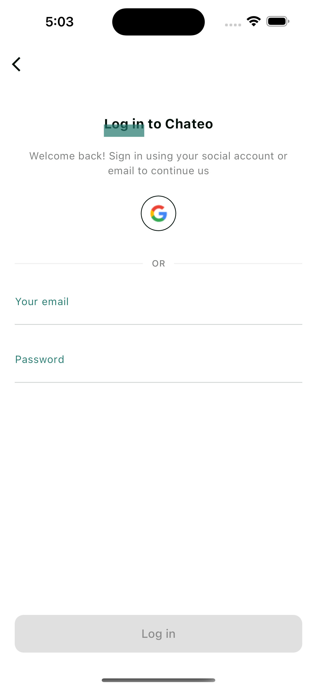
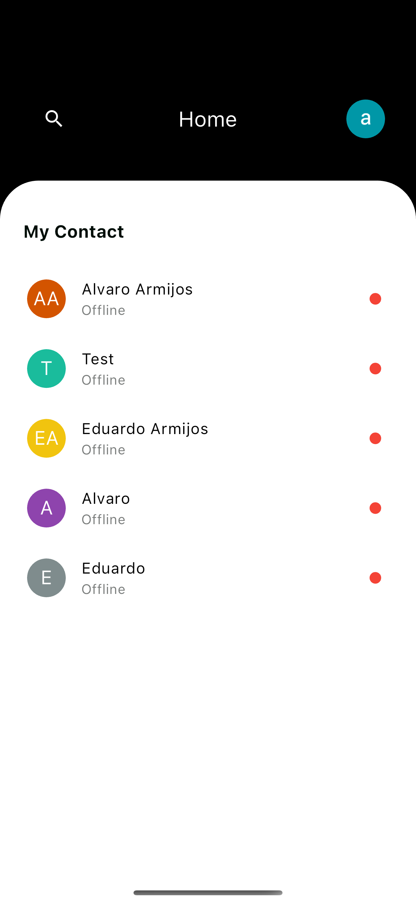
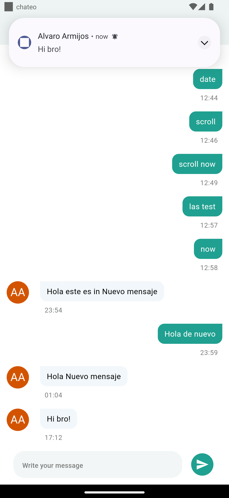

# Chateo

## Real-Time Chat Application with Flutter, Firebase, and Cloud Functions Repository

Welcome to our Real-Time Chat Application repository! 🚀

This Flutter application leverages the power of Firebase and Cloud Functions to provide a seamless and feature-rich chatting experience. Here's what you can expect:

## Features:

- Email Registration: Users can sign up using their email.
- Email and Password Login: Secure login with email and password credentials.
- Google Sign-In: Convenient sign-in option using Google authentication.
- User Profiles: Personalized user profiles to enhance the chatting experience.
- Contact List: Easily accessible list of contacts for quick connections.
- Connection Status: Real-time indication of users' online/offline status.
- Real-Time Chat: Enjoy instant messaging with real-time updates.
- Push Notifications: Cloud Functions trigger push notifications for each new message, providing sender names and message previews.

Feel free to explore the code, contribute, or use it as a reference for your own projects. Happy coding! 🌐💬

## Screenshots

     
     
     
     
     

Find the repository for the Cloud Functions responsible for sending push notifications [here](https://github.com/alvaroarmijos/chateo-notifications).